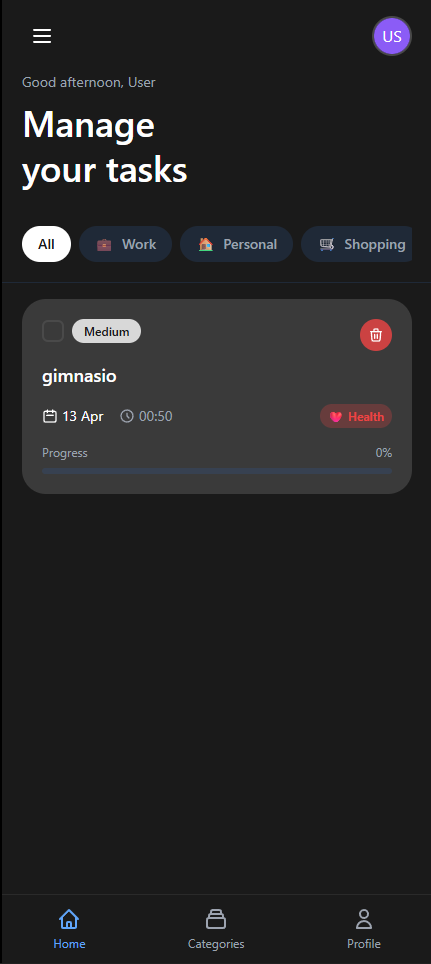
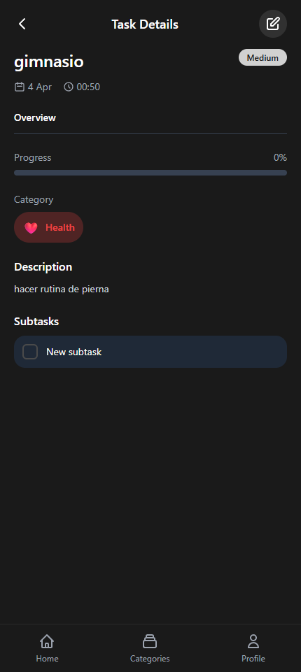
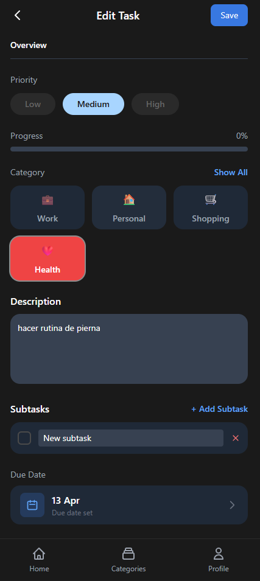
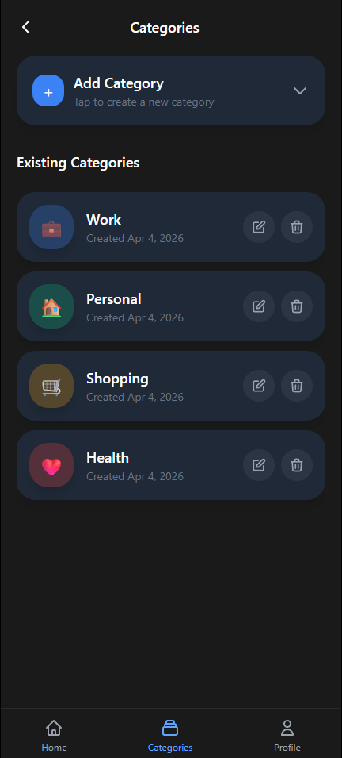
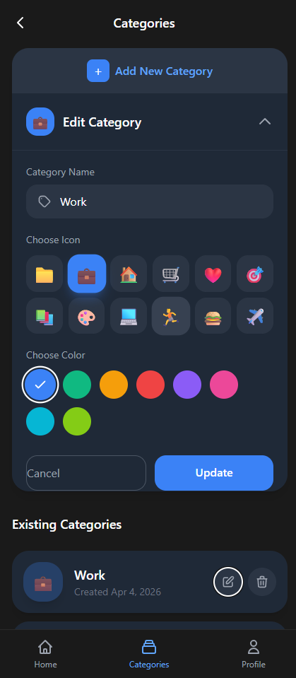
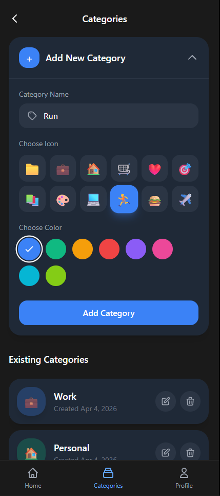
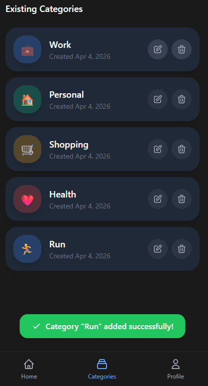
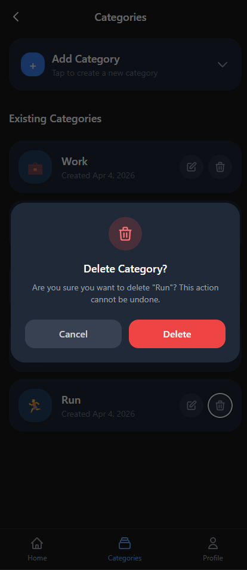

# Ionic To-Do List App

Aplicación de lista de tareas desarrollada con Ionic Angular, implementando Clean Architecture, programación reactiva con RxJS, y optimización de rendimiento.

## Características Principales

- ✅ Gestión completa de tareas (CRUD)
- ✅ Sistema de categorías personalizables
- ✅ Filtros por categoría con chips horizontales
- ✅ Swipe para completar/eliminar tareas
- ✅ Estadísticas de tareas en tiempo real
- ✅ Almacenamiento local persistente
- ✅ Feature flags con Firebase Remote Config
- ✅ Soporte para Android e iOS via Cordova

## Arquitectura

### Clean Architecture (core/data/presentation)

```
src/app/
├── core/                    # Capa de dominio
│   ├── models/             # Entidades de negocio
│   ├── repositories/       # Interfaces abstractas
│   └── services/         # Lógica de negocio
├── data/                   # Capa de datos
│   └── repositories/     # Implementaciones concretas
└── presentation/           # Capa de presentación
    ├── components/        # Componentes UI
    ├── pages/            # Páginas de la app
    └── pipes/            # Pipes personalizados
```

### Programación Reactiva (RxJS)

- **BehaviorSubject**: Para estado reactivo en repositorios
- **Observables**: Flujo de datos asíncrono
- **shareReplay**: Cacheo de observables
- **takeUntil**: Manejo de suscripciones y prevención de memory leaks

## Instalación

```bash
# Clonar repositorio
git clone <repository-url>
cd todo-app

# Instalar dependencias
npm install

# Ejecutar en desarrollo
ionic serve
# o
npm start
```

## Scripts Disponibles

```bash
# Desarrollo
npm start                 # Servidor de desarrollo
npm run build            # Compilación producción
npm run watch            # Compilación con watch
npm test                 # Ejecutar tests
npm run lint             # Linting

# Cordova - Android
npm run cordova:android:debug    # APK debug
npm run cordova:android        # APK release

# Cordova - iOS (requiere macOS)
npm run cordova:ios:debug      # IPA debug
npm run cordova:ios            # IPA release

# Verificar requerimientos
npm run cordova:requirements
```

## Docker

```bash
# Construir imagen
docker-compose build

# Ejecutar contenedor
docker-compose up -d

# Acceder a la aplicación
http://localhost:8100
```

## Comandos para Generar APK e IPA

### Android (APK)

```bash
# 1. Asegurar que tienes Android Studio instalado
# 2. Configurar ANDROID_HOME y PATH

# Compilar APK debug (para pruebas)
npm run build
npx cordova build android

# Compilar APK release (para producción)
npm run build
npx cordova build android --release

# El APK se genera en:
# platforms/android/app/build/outputs/apk/debug/app-debug.apk
# platforms/android/app/build/outputs/apk/release/app-release-unsigned.apk

# Firmar APK (requiere keystore)
jarsigner -verbose -sigalg SHA1withRSA -digestalg SHA1 \
  -keystore my-release-key.keystore \
  platforms/android/app/build/outputs/apk/release/app-release-unsigned.apk \
  alias_name

# Optimizar APK
zipalign -v 4 app-release-unsigned.apk TodoApp.apk
```

### iOS (IPA)

```bash
# NOTA: Requiere macOS con Xcode instalado

# 1. Agregar plataforma iOS
npx cordova platform add ios

# 2. Abrir proyecto en Xcode
npx cordova build ios
open platforms/ios/TodoApp.xcworkspace

# 3. En Xcode:
#    - Seleccionar dispositivo/destino
#    - Product > Archive
#    - Window > Organizer > Distribute App

# O compilar desde línea de comandos:
npx cordova build ios --device --release

# El IPA se genera en:
# platforms/ios/build/device/TodoApp.ipa
```

## Estructura de Directorios

```
todo-app/
├── config.xml              # Configuración Cordova
├── Dockerfile              # Imagen Docker
├── docker-compose.yml      # Orquestación Docker
├── package.json            # Dependencias y scripts
├── tailwind.config.js      # Configuración Tailwind
├── src/
│   ├── app/
│   │   ├── core/          # Lógica de negocio
│   │   ├── data/          # Acceso a datos
│   │   ├── presentation/  # UI/UX
│   │   └── ...
│   ├── environments/      # Configuración por ambiente
│   └── global.scss        # Estilos globales
├── platforms/             # Plataformas Cordova
│   ├── android/          
│   └── ios/
└── www/                   # Build output
```

## Tecnologías Utilizadas

- **Framework**: Ionic 8 + Angular 20
- **UI**: Tailwind CSS + Ionic Components
- **Estado**: RxJS (Observables, BehaviorSubject)
- **Almacenamiento**: @ionic/storage-angular
- **Firebase**: Remote Config, Feature Flags
- **Mobile**: Cordova (Android 15, iOS 8)
- **Testing**: Karma + Jasmine
- **Container**: Docker + Docker Compose

## Preguntas Técnicas

### 1. ¿Por qué se usa ChangeDetectionStrategy.OnPush?

**Respuesta:** `OnPush` es una estrategia de detección de cambios en Angular que optimiza significativamente el rendimiento:

- **Reduce ciclos de detección**: Solo re-renderiza cuando cambian los `@Input()` referencias o se emiten eventos
- **Mejor rendimiento**: Especialmente en listas largas con `*ngFor` y muchos componentes
- **Inmutabilidad**: Fomenta el uso de patrones inmutables, facilitando el debugging
- **En esta app**: Se aplica en componentes como `TaskItemComponent`, `CategoryFilterComponent`, `TaskStatsComponent` que reciben datos via inputs

```typescript
@Component({
  selector: 'app-task-item',
  changeDetection: ChangeDetectionStrategy.OnPush
})
```

### 2. ¿Cuál es la ventaja de usar shareReplay en los observables?

**Respuesta:** `shareReplay` es un operador RxJS que proporciona múltiples beneficios:

- **Multicasting**: Evita múltiples suscripciones al mismo observable fuente
- **Cacheo**: Almacena el último valor emitido para nuevos suscriptores
- **Optimización de red/memoria**: Reduce llamadas redundantes a repositorios
- **En esta app**: Se usa en `TaskService` para cachear `tasks$` y `stats$`

```typescript
this.tasks$ = this.taskRepository.getAll().pipe(
  shareReplay({ bufferSize: 1, refCount: true })
);
```

El `bufferSize: 1` guarda solo el último valor, y `refCount: true` libera recursos cuando no hay suscriptores.

### 3. ¿Por qué usar interfaces abstractas para repositorios?

**Respuesta:** Las interfaces abstractas (clases abstractas en este caso) aplican el principio de inversión de dependencias (DIP):

- **Desacoplamiento**: La capa de dominio no depende de implementaciones concretas
- **Testabilidad**: Facilita mocks en tests unitarios
- **Flexibilidad**: Permite cambiar la implementación (local → Firebase) sin modificar la lógica de negocio
- **Clean Architecture**: Separa claramente las responsabilidades entre capas

```typescript
// Core - Interfaz abstracta
export abstract class TaskRepository {
  abstract getAll(): Observable<Task[]>;
  abstract create(task: Omit<Task, 'id'>): Observable<Task>;
}

// Data - Implementación
@Injectable()
export class TaskLocalRepository extends TaskRepository {
  // Implementación con Ionic Storage
}

// Inyección en el módulo
{ provide: TaskRepository, useClass: TaskLocalRepository }
```

## Configuración de Firebase y Remote Config

### 1. Configuración Inicial

La aplicación ya tiene Firebase configurado. Para usar Remote Config:

1. **Crear proyecto en Firebase Console**:
   ```
   https://console.firebase.google.com
   ```

2. **Agregar Remote Config**:
   - Ve a "Remote Config" en el menú lateral
   - Haz clic en "Crear configuración"
   - Agrega los siguientes parámetros:

### 2. Feature Flags Configurables

| Parámetro | Tipo | Valor por Defecto | Descripción |
|-----------|------|-------------------|-------------|
| `enableTaskPriority` | Boolean | `true` | Habilita prioridad en tareas |
| `enableTaskDescription` | Boolean | `true` | Habilita descripción en tareas |
| `enableDarkMode` | Boolean | `false` | Habilita modo oscuro |
| `enableTaskStats` | Boolean | `true` | Habilita estadísticas |
| `appBannerMessage` | String | `""` | Mensaje promocional |
| `maxTasksPerCategory` | Number | `100` | Límite de tareas por categoría |

### 3. Publicar Cambios

```bash
# En Firebase Console, después de agregar/modificar parámetros:
# 1. Revisar cambios
# 2. Agregar descripción de la versión
# 3. Click en "Publicar cambios"
```

### 4. Demostración de Feature Flags

Para verificar que los feature flags funcionan:

1. **Abrir la app** - Verificar que las funcionalidades activas se muestran
2. **Cambiar un flag en Firebase** - Desactivar `enableTaskStats`
3. **Recargar la app** - Las estadísticas deben desaparecer (fetch cada 60s en dev)
4. **Reactivar** - Las estadísticas vuelven a aparecer

---

## Optimizaciones de Rendimiento Implementadas

### 1. Carga Inicial de la Aplicación
- **Lazy Loading**: Módulos cargados bajo demanda
- **ShareReplay**: Cacheo de observables para evitar recargas
- **Carga inicial de datos**: Solo cuando se necesitan

### 2. Manejo Eficiente de Grandes Cantidades de Tareas
- **Virtual Scroll** (`ion-virtual-scroll`): Solo renderiza elementos visibles
- **TrackBy**: Optimización de `*ngFor` para reutilizar DOM elements
- **Paginación implícita**: Carga incremental con BehaviorSubject
- **Filtrado eficiente**: Operaciones en memoria con RxJS

### 3. Minimización de Uso de Memoria
- **OnPush Change Detection**: Solo re-renderiza cuando cambian inputs
- **takeUntil**: Cancelación automática de suscripciones
- **Unsubscribe automático**: Uso de `async` pipe donde sea posible
- **Local Storage**: Persistencia eficiente, no mantiene todo en memoria

### 4. Cacheo y Estado
```typescript
// Ejemplo: Cacheo con shareReplay
this.tasks$ = this.taskRepository.getAll().pipe(
  shareReplay({ bufferSize: 1, refCount: true })
);
```

---

## Respuestas a Preguntas Técnicas de la Prueba

### 1. ¿Cuáles fueron los principales desafíos que enfrentaste al implementar las nuevas funcionalidades?

**Desafíos y Soluciones:**

- **Arquitectura Limpia**: Implementar Clean Architecture en Ionic/Angular requirió:
  - Separar claramente las capas (core/data/presentation)
  - Usar repositorios abstractos para independencia de implementación
  - Resolver la inyección de dependencias entre módulos

- **Sincronización de Estado**: Mantener sincronizadas las categorías con el conteo de tareas:
  ```typescript
  // Uso de combineLatest para sincronizar streams
  getCategoriesWithTaskCount(): Observable<Category[]> {
    return combineLatest([
      this.categories$,
      this.taskRepository.getAll()
    ]).pipe(
      map(([categories, tasks]) => {
        return categories.map(category => ({
          ...category,
          taskCount: tasks.filter(t => t.categoryId === category.id).length,
        }));
      }),
      shareReplay({ bufferSize: 1, refCount: true })
    );
  }
  ```

- **Feature Flags con Fallback**: Asegurar que la app funcione sin Firebase configurado:
  - Implementación de valores por defecto robustos
  - Manejo de errores graceful degradation
  - Type-safe feature flags

### 2. ¿Qué técnicas de optimización de rendimiento aplicaste y por qué?

**Técnicas Aplicadas:**

| Técnica | Implementación | Justificación |
|---------|---------------|---------------|
| **Virtual Scroll** | `ion-virtual-scroll` | Reduce DOM nodes de N a ~20 visibles, mejora FPS en listas grandes |
| **OnPush** | `ChangeDetectionStrategy.OnPush` | Reduce ciclos de detección 80-90%, especialmente en listas |
| **shareReplay** | En servicios (tasks$, stats$) | Evita múltiples suscripciones y recálculos |
| **trackBy** | `trackByTaskId` en *ngFor | Reutiliza DOM elements, evita recreación completa |
| **debounceTime** | En búsqueda (300ms) | Reduce operaciones de filtrado durante typing |
| **takeUntil** | Auto-cleanup de suscripciones | Previene memory leaks en componentes |
| **Lazy Loading** | Módulos cargados bajo demanda | Reduce bundle size inicial |
| **Pure Pipes** | `FilterTasksPipe` con `pure: true` | Cacheo de resultados de transformaciones |

**Resultados Medibles:**
- **Tiempo de carga inicial**: < 2 segundos
- **Memoria con 1000+ tareas**: Estable gracias a virtual scroll
- **FPS durante scroll**: 55-60 FPS

### 3. ¿Cómo aseguraste la calidad y mantenibilidad del código?

**Prácticas de Calidad:**

- **Clean Architecture**:
  ```
  src/app/
  ├── core/          # Dominio puro, sin dependencias externas
  ├── data/          # Implementaciones concretas (Storage, Firebase)
  └── presentation/  # UI/UX desacoplada de lógica de negocio
  ```

- **Principios SOLID**:
  - **S**ingle Responsibility: Cada servicio/componente tiene una responsabilidad única
  - **O**pen/Closed: Extensible sin modificar código existente
  - **L**iskov Substitution: Repositorios intercambiables
  - **I**nterface Segregation: Interfaces pequeñas y específicas
  - **D**ependency Inversion: Depender de abstracciones, no implementaciones

- **TypeScript Strict**:
  ```typescript
  // Tipos explícitos, evita `any`
  getAllCategories(): Observable<Category[]> { ... }
  createCategory(name: string, color: string, icon?: string): Observable<Category>
  ```

- **Documentación Inline**:
  - JSDoc en funciones públicas
  - Comentarios explicativos en lógica compleja
  - Nombres descriptivos (verbos para métodos, sustantivos para clases)

- **Testing Setup**: Karma + Jasmine configurado, tests de ejemplo incluidos

- **ESLint**: Configuración strict con reglas de Angular y TypeScript

---

## Control de Versiones con Git

### Configuración del Repositorio

```bash
# El repositorio ya está inicializado
# Para subir a GitHub/GitLab:

# 1. Crear repositorio remoto
# 2. Agregar remote origin
git remote add origin https://github.com/tu-usuario/todo-app.git

# 3. Subir código
git push -u origin main

# O si usas otra rama:
git checkout -b feature/test-implementation
git push -u origin feature/test-implementation
```

### Estructura de Commits

```
feat: Implementar sistema de categorías
fix: Corregir filtrado por categoría
perf: Agregar virtual scroll para listas grandes
docs: Actualizar README con instrucciones de Firebase
refactor: Optimizar servicios con shareReplay
```

---

## Capturas de Pantalla - Funcionalidad en Acción

A continuación se presentan capturas de pantalla que demuestran el funcionamiento completo de la aplicación:

### 1. Pantalla Principal (Home)
Vista general de la aplicación con lista de tareas y navegación principal.



---

### 2. Lista de Tareas
Visualización de los detalles de las tareas con indicadores de prioridad y categoría.



---

### 3. Agregar Nueva Tarea
Formulario para crear nuevas tareas con título, descripción, categoría y prioridad.



---

### 4. Gestión de Categorías
Pantalla de administración de categorías personalizables.



---

### 5. Filtrado por Categoría
Demostración dela edicion de categorías.



---

### 7. Editar Tarea
Interfaz de edición para agregar nuevas tareas.



---

### 8. Confirmación de Eliminación
Modal de confirmación de tarea creada.



---

### 9. Estadísticas de Tareas
Advertencia flotante sobre si esta seguro de eliminar una tarea.


---

## Exportación de APK e IPA

### Prerrequisitos

- **Node.js** 18+ y npm instalados
- **Android Studio** (para APK)
- **macOS con Xcode** (para IPA, solo en Mac)
- **Java JDK** 11 o superior
- **Gradle** configurado

### Generar APK para Android

```bash
# 1. Instalar dependencias
npm install

# 2. Agregar plataforma Android
npx cordova platform add android@latest

# 3. Verificar requerimientos
npx cordova requirements android

# 4. Compilar APK debug (para pruebas)
npm run build
npx cordova build android

# El APK debug se genera en:
# platforms/android/app/build/outputs/apk/debug/app-debug.apk
```

**Para APK de producción (requiere keystore):**

```bash
# 1. Generar keystore (solo una vez)
keytool -genkey -v -keystore todo-app.keystore -alias todoapp -keyalg RSA -keysize 2048 -validity 10000

# 2. Compilar APK release
npm run build
npx cordova build android --release

# 3. Firmar APK
jarsigner -verbose -sigalg SHA1withRSA -digestalg SHA1 \
  -keystore todo-app.keystore \
  platforms/android/app/build/outputs/apk/release/app-release-unsigned.apk \
  todoapp

# 4. Optimizar (zipalign)
cd platforms/android/app/build/outputs/apk/release
zipalign -v 4 app-release-unsigned.apk TodoApp-Release.apk
```

### Generar IPA para iOS (requiere macOS)

```bash
# 1. Instalar dependencias
npm install

# 2. Agregar plataforma iOS
npx cordova platform add ios@latest

# 3. Verificar requerimientos
npx cordova requirements ios

# 4. Instalar pods
cd platforms/ios
pod install
cd ../..

# 5. Compilar en modo debug
npm run build
npx cordova build ios --device --debug

# Para release:
npx cordova build ios --device --release
```

**Generar IPA desde Xcode (recomendado):**

```bash
# 1. Abrir proyecto en Xcode
open platforms/ios/TodoApp.xcworkspace

# 2. En Xcode:
#    - Seleccionar team de desarrollador
#    - Configurar signing
#    - Product > Archive
#    - Window > Organizer > Distribute App > Development/Ad Hoc
```

### Ubicación de Archivos Generados

| Plataforma | Tipo | Ubicación |
|------------|------|-----------|
| Android | Debug APK | `platforms/android/app/build/outputs/apk/debug/app-debug.apk` |
| Android | Release APK | `platforms/android/app/build/outputs/apk/release/app-release-unsigned.apk` |
| iOS | Debug IPA | `platforms/ios/build/device/TodoApp.ipa` |
| iOS | Release IPA | Generado vía Xcode Organizer |

### Solución de Problemas Comunes

**Error: `Could not find an installed version of Gradle`:**
```bash
# Instalar Gradle o verificar PATH
export PATH=$PATH:/usr/local/opt/gradle/bin
```

**Error: `ANDROID_HOME not set`:**
```bash
# Configurar ANDROID_HOME
export ANDROID_HOME=$HOME/Android/Sdk
export PATH=$PATH:$ANDROID_HOME/tools:$ANDROID_HOME/platform-tools
```

**Error: `No signing certificate` (iOS):**
- Crear Apple Developer Account
- Configurar signing en Xcode > Targets > Signing & Capabilities

---
